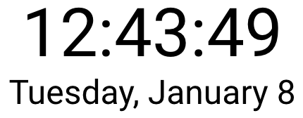

React MobX Clock
================
MobX-based clock showing refreshes triggered by the JavaScript timer.



Getting Started
---------------
```bash
$ yarn
$ yarn start
```

Now point your browser to http://localhost:3000/.
